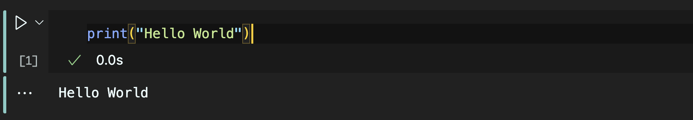
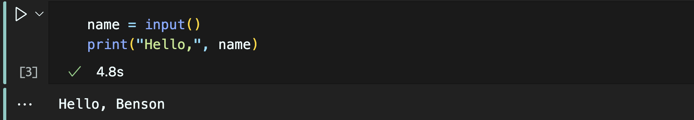
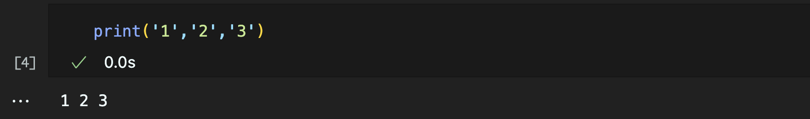
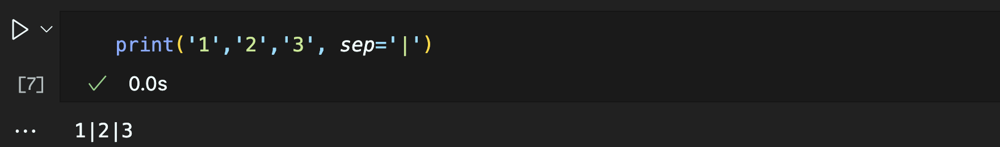
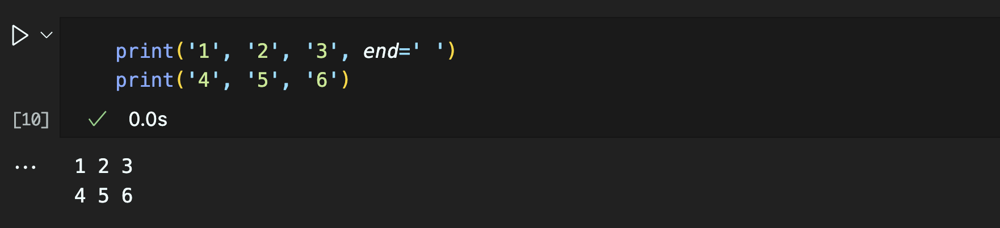

# Chapter 1 ： Introduction

> **Benson Chiu** 邱秉辰 @ NTU IM CAMP 2024
> Department of Information Management, National Taiwan University.

## 前言

### 什麼是程式語言

簡單來說，程式語言是人類與電腦**溝通的媒介**。透過程式語言，**編譯器**會將人類輸入的**程式指令**轉換成電腦讀得懂的**機器語言**，讓電腦執行我們期望的操作。

廣義上，程式語言是一種用來定義和控制電腦程式的語言類型，依照**與人類語言的相近程度**可大致分為**「低階語言」**和**「高階語言」**

- 低階語言 (Low-level programming languages)
  - 此處的「低階」，指的是**較接近硬體**，語法上更接近以二進制寫成的**機器語言**
  - 對人類而言**易讀性較低**，但可以更精準、有效率地控制電腦的運作
  - 舉例：機器語言 (Machine Code)、組合語言 (Assembly Language)
- 高階語言 (High-level programming languages)
  - 此處的「高階」，指的是**較接近人類**，語法上更接近人類實際溝通的樣貌
  - 高階程式語言的**易讀性較高**，和低階語言與機器語言相較開發**較為簡潔、方便**
  - 舉例：C/C++、Python、Java、JavaScript

### 什麼是 Python

[Python in 100 Seconds - YouTube](https://www.youtube.com/watch?v=x7X9w_GIm1s)

Python 是一個**高階程式語言**，由 Guido van Rossum 於 1991 年首度釋出，目前已經發展至 Python 3.0，擁有簡潔、易學的語法與廣泛的第三方函式庫。

透過強大的第三方套件，Python 被運用於多個領域，是當今最熱門的程式語言之一，以下是一些舉例：

- 數值運算與資料分析：[SciPy](http://scipy.org/), [NumPy](https://numpy.org/), [Pandas](https://pandas.pydata.org/)
- 網頁爬蟲與資料擷取：[Requests](https://pypi.org/project/requests/), [Beautiful Soup](http://www.crummy.com/software/BeautifulSoup/)
- 機器學習與深度學習：[TensorFlow](https://www.tensorflow.org/), [PyTorch](https://pytorch.org/), [Keras](https://keras.io/)
- 網頁開發框架：[Django](http://www.djangoproject.com/) 

## 環境安裝 - Jupyter Notebook

### 什麼是 Jupyter Notebook?

Jupyter Notebook 是一個被廣泛用的 Python 編輯與開發環境，可以使我們以「區塊」為單位編寫、編譯、執行程式碼，或者在該區塊使用 Markdown 語法製作筆記。

關於 Jupyter Notebook 的詳細介紹，讀者可以參考 [Jupyter Notebook 介紹、安裝及使用說明 (2023更新版) - SimpleLearn](https://simplelearn.tw/jupyter-notebook-intro-and-tutorial/)。在資管營的課程中，我們將會**以 [Jupyter Notebook](https://jupyter.org/) 作為主要編輯與開發環境**。

### Jupyter Notebook 安裝教學

#### [方法一] 使用 Anaconda 安裝 

我們可以將 Anaconda 想像成 Python 各種**資料科學、機器學習相關套件**的**集大成**，是全世界最受歡迎的 Python 資料科學平台。其中，Jupyter Notebook 已經被內建於 Anaconda 當中。

有關 Anaconda 的安裝步驟，讀者可以參考 [Anaconda 3 介紹及安裝教學 (2023更新版) - SimpleLearn](https://simplelearn.tw/anaconda-3-intro-and-installation-guide/)

#### [方法二] 使用 pip 安裝

1. 在 Terminal (PowerShell in Windows) 檢查 Python 是否有被成功安裝

   ```bash
   python --version
   ```

    若沒有成功顯示 **Python 的版本編號**，代表尚未安裝 Python，請至[官網]([Welcome to Python.org](https://www.python.org/))下載並安裝最新版本的 Python

2. 接著，在 Terminal (PowerShell in Windows) 輸入以下指令，開始安裝 Jupyter Notebook

   ```bash
   pip install notebook
   ```

3. 安裝完畢後，在 Terminal (PowerShell in Windows) 輸入以下指令即可用瀏覽器開啟 Jupyter Notebook

   ```
   jupyter notebook
   ```

#### [方法三] 在 Visual Studio Code 中使用 Jupyter Notebook 

- 到 **Extension** 視窗，安裝 [Python](https://marketplace.visualstudio.com/items?itemName=ms-python.python) 與 [Jupyter](https://marketplace.visualstudio.com/items?itemName=ms-toolsai.jupyter) 兩項套件
- 安裝完畢後，新增副檔名為 `.ipynb` 的檔案，即可開始使用 Jupyter Notebook 編輯並執行 Python 程式
- 有關詳細的使用說明，讀者可以參考 [官方文件 - Working with Jupyter Notebooks in Visual Studio Code](https://code.visualstudio.com/docs/datascience/jupyter-notebooks)

### Jupyter Notebook 使用技巧

#### 常用的快捷鍵：

- `Ctrl+Enter` - 執行當前的區塊
- `Shift+Enter` -  切換至下一個區塊
- `Ctrl+S` - 存檔
- `dd` - 刪除該區塊
- 模式切換
  - `M` -  切換至 Markdown 模式 
  -  `Y` - 切換至 Code 模式

## Hello World

安裝完 Python 與 Jupyter Notebook 之後，我們接著就來編寫我們的第一個 Python 程式。

在 Jupyter Notebook 新增一個 Code 模式的區塊，並且放置下述程式碼：

```py
print("Hello World")
```

按下 `Ctrl+Enter` 執行，區塊底下就會出現程式碼的輸出結果！



除了輸出之外，我們也可以使用 `input()` 讀取使用者的輸入內容：

```py
name = input()
print("Hello,", name)
```



Jupyter Notebook 會跳出視窗請使用者輸入一段文字，該文字隨即被 `input()` 函數吸收並將其「指派」給 `name` 變數（將會在下一節詳細介紹），並由接下來的 `print("Hello,", name)` 處理輸出。

我們可以同時在 `print()`中同時放入多個變數或字串，在括號中以**逗點**分隔，而輸出結果則是**預設**以**空格字元**做分隔，舉例來說：

```python
print('1','2','3')
```

的輸出結果會是



若我們想要指定**分隔字元**，可以使用 `print()`函數中的  `sep`，舉例來說：

```python
print('1','2','3', sep='|')
```

的輸出結果會是



Python 預設使用 `print()` 輸出內容後會在結尾 **自動換行**

```py
print('1', '2', '3')
print('4', '5', '6')
```


若我們想要替換掉結尾的換行效果，可以使用 `print()`函數中的  `end` 指定輸出結尾所放置的字元，舉例來說：

```py
print('1', '2', '3', end=' ')
print('4', '5', '6')
```




## References

- [Python 3.11 Documentation]( https://docs.python.org/3/contents.html)
- [What Is a Programming Language? (codecademy.com)](https://www.codecademy.com/resources/blog/programming-languages/)
-  [Jupyter Notebook 介紹、安裝及使用說明 (2023更新版) - SimpleLearn](https://simplelearn.tw/jupyter-notebook-intro-and-tutorial/)
-  [Anaconda 3 介紹及安裝教學 (2023更新版) - SimpleLearn](https://simplelearn.tw/anaconda-3-intro-and-installation-guide/)

If you have any questions, feel free to ask me via my email :) 

- [bensonchiu1129@gmail.com](mailto:bensonchiu1129@gmail.com)
- [bensonchiu1129@ntu.im](https://imbensonchiu.github.io/bensonchiu1129@ntu.im)

*Copyright © 2023 Benson Chiu. All rights reserved.*