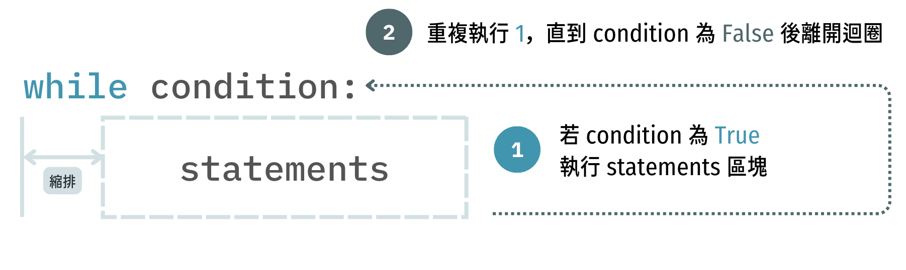
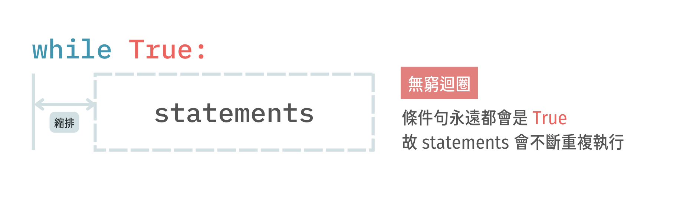
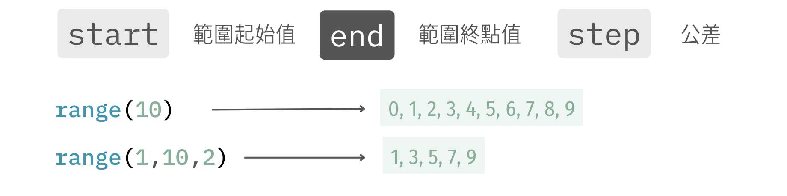
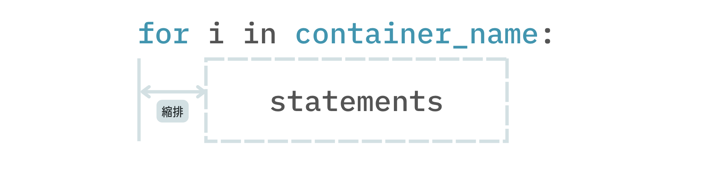
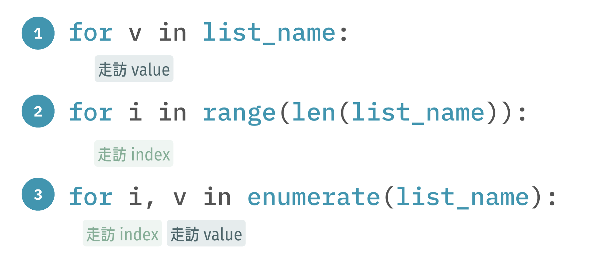
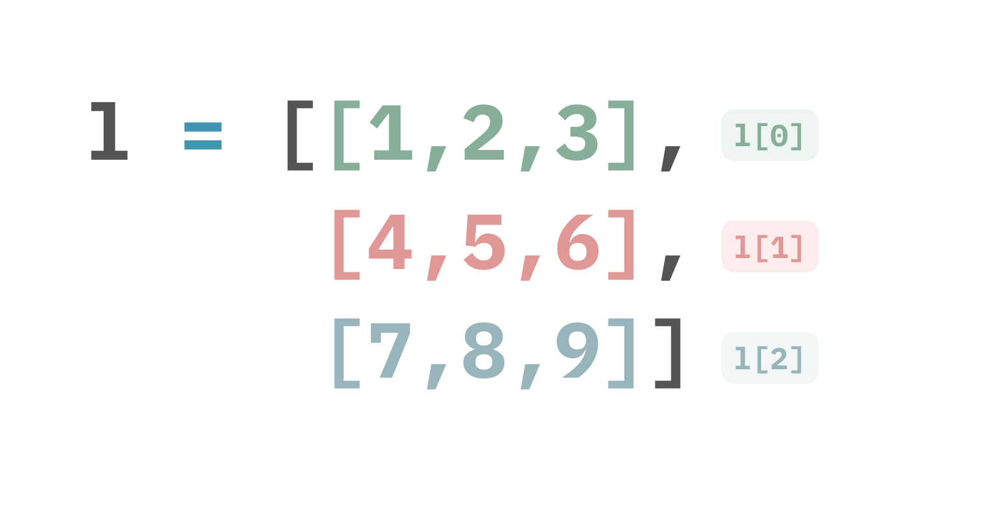
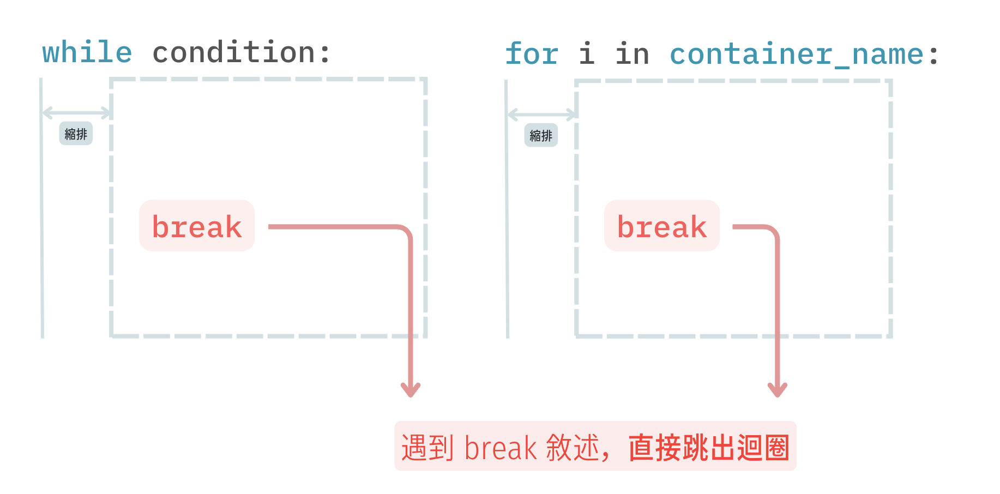
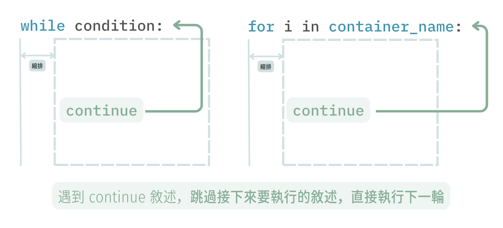

# Chapter 5 ： 迴圈

> **Benson Chiu** 邱秉辰 @ NTU IM CAMP 2024
> Department of Information Management, National Taiwan University.

在課程的 **Chapter 3** 當中，我們學習了**判斷**的用法。透過 `if-elif-else` ，我們得以在 Python 中根據**不同條件**而執行**相對應區塊中**的敘述。在本章，我們繼續討論 Python 的**控制流程**中另一個常會遇到且重要的主題 —— **迴圈(Loops)**。

## 什麼是迴圈？

我們引用[維基百科](https://zh.wikipedia.org/zh-tw/%E8%BF%B4%E5%9C%88)的定義：

> - 迴圈是一段在程式中只出現一次，但**可能會連續執行多次的程式碼**。
> - 迴圈中的程式碼會**執行特定的次數**，或者是執行到**特定條件成立**時結束迴圈，或者是針對**某一容器中的所有項目**都執行一次。

白話來說，透過 Python 當中迴圈的語法，我們得以讓程式碼中的某個片段**重複執行多次**。

## 迴圈的主要種類

在 Python 中，主要的迴圈語法包含 `while` 與 `for` ，功能各自簡要敘述如下：

- **` while` 迴圈**：重複執行直到**特定條件成立**時結束迴圈
- **`for` 迴圈**：執行特定的次數、針對**某一容器中的**所有項目都執行一次 

---

## `while` 迴圈

### 基本用法 *	



`while` 迴圈是一個以**條件判斷**為重點的迴圈：

1. 進入迴圈時，程式會執行第一次條件判斷，若該判斷式的結果為 False，程式會直接跳過迴圈並執行接下來的敘述。
2. 若該判斷式的結果為 True，程式會執行迴圈內的敘述，執行完畢後回到判斷式執行判斷。
3. 重複執行 **步驟二** ，直到判斷式的結果為 False，程式離開迴圈並執行接下來的敘述。

```python
# 範例 5.1
n = 1
while n <= 10:
    print("Hello World")
    n += 1
print(n)
```

### 無窮迴圈 **

如果條件句一直都是 True，迴圈自然而然就會一直執行下去，運用這個概念，我們可以設計**無窮迴圈**。



```python
# 範例 5.2
while True:
    name = input()
    print("Hello, ", name)
```

## `for` 迴圈

### 計數迴圈 - 使用 `range() ` *

透過 `for` 迴圈與 `range()` 函數的搭配，我們得以讓迴圈中的程式碼**執行特定的次數**，語法簡述如下：


在 Python 中，`range(start, end, step)` 函數會依照我們給定的**起始值 (`start`)、終點值 (`end`)** 與**公差(`step`) **生成相對應的數列。

> 需要特別注意的是，**數列的右界並不包含終點值 (`end`)**，換句話說，我們皆是討論 $[start, end)$ 的**左閉右開**區間範圍。[若讀者未接觸過區間符號的表示法，只需知道數列的右界並不包含 `end` 就好，左閉右開只是為了方便學過區間符號的人理解]



產生數列後，透過 `for i in range(...)` 讓 `i` 走訪該數列中的每一個元素：

```py
# 範例 5.3.1
for i in range(10):
    print(i)
```

```python
# 範例 5.3.2
for i in range(1, 10, 2):
    print(i)
```

### 走訪容器 - 以 list 為例 *

在迴圈的定義中，迴圈中的程式碼也可以針對**某一容器中的所有項目**都執行一次，語法簡述如下：



透過上述語法，我們讓 `i` 依序走訪 `container_name` 容器中每一項元素，並且每次走訪皆執行迴圈內的敘述。

截至目前，我們已經在 **Chapter 4** 學習了 Python `list` 的用法，顯然地，**`list` 也是 Python 中容器的其中一種**，我們可以運用 `for` 迴圈對 `list` 中的每一個元素進行走訪。

> 想想看：前一小節的 `range()` 函數所產生的數列也是一個容器嗎？

```py
# 範例 5.4.1
l = [1, 2, 3, 4, 5]
for i in l:
    print(i)
```

接著，我們嘗試透過上述用法將 `l` 中的每一項加 1

```python
# 範例 5.4.2
l = [1, 2, 3, 4, 5]
for i in l:
    i = i + 1
print(l) #[1, 2, 3, 4, 5]
```

`l` 並沒有成功地被修改，如何解決？我們可以改以走訪 `l` 的索引 (indices)

```python
# 範例 5.4.3
l = [1, 2, 3, 4, 5]
for i in range(len(l)):
    l[i] = l[i] + 1
print(l) #[2, 3, 4, 5, 6]
```

[**] 除此之外，我們也可以運用 `enumerate()` 同時對 `l`  的索引 (indices) 和值 (values) 作走訪

```py
# 範例 5.4.4
l = [1, 2, 3, 4, 5]
for i, v in enumerate(l):
    print(i, v)
```

我們最後將 `list` 的三種走訪方式整理如下：



再次提醒，若我們要對 `list` 裡面的元素進行修改，我們**只能運用索引 (index) 進行改值**，換句話說，[法 1] 是無法對串列中的值進行修改的！

### 巢狀迴圈 **

當我們遇到二維（甚至是多維）容器的情形，往往需要在**迴圈當中**放入另一個**迴圈敘述**，我們稱之為巢狀迴圈。巢狀迴圈可以是兩層、三層、四層...... 我們在此僅討論最常見的兩層情形。

在**範例 5.5** 中，`l` 是一個二維的 list，我們透過上一小節的 [法 1] 印出它每一項的元素值

```py
#範例 5.5.1
l = [[1, 2, 3], [4, 5, 6], [7, 8, 9]]
for i in l:
    print(i)
```

我們可以發現，**範例 5.5.1** 印出了三條 `list`。該結果不難理解，因為我們可以將 `l`視為一條 **元素為 `list` 的一維 `list` **，簡單圖解如下：



若我們需要每行**單獨**印出 `l` 中的**所有數字**，我們便需要再**新增一層迴圈**針對 `l` 中的**每一條 `list` **各自再進行走訪

```python
#範例 5.5.2
l = [[1, 2, 3], [4, 5, 6], [7, 8, 9]]
for i in l:
    for j in i:
        print(j)
```

當然，我們也可以使用 [法 2] 走訪 list 的索引 (index)

```python
#範例 5.5.3 (和 5.5.2 等價）
l = [[1, 2, 3], [4, 5, 6], [7, 8, 9]]
for i in range(len(l)):
    for j in range(len(l[i])):
        print(l[i][j])
```

## `break` 與 `continue` 敘述

### 認識 `break` *

當迴圈執行時遇到 `break` 敘述，程式會**直接中止該迴圈的運作**並執行接續的程式碼



```python
#範例 5.6.1
l = [1, 2, 3, 4, 5]
for i in l:
    if i == 3:
        break
    print(i)
```

```python
#範例 5.6.2
while True:
    name = input()
    if name == "Benson":
        break
    print("Hello, ", name)
```

### 認識 `continue` *

當迴圈執行時遇到 `continue` 敘述，程式會**跳過接下來要執行的敘述，直接執行下一輪**



```python
#範例 5.7.1
l = [1, 2, 3, 4, 5]
for i in l:
    if i == 3:
        continue
    print(i)
```

```python
#範例 5.7.2
while True:
    name = input()
    if name == "Benson":
        continue
    print("Hello, ", name)
```


---

## References

- [Python 3.11 Documentation]( https://docs.python.org/3/contents.html)
- [W3School - Python Tutorial](https://www.w3schools.com/python/default.asp)
- [資訊之芽 Python 班歷年講義](https://tw-csie-sprout.github.io/py2023/) 

If you have any questions, feel free to ask me via my email :) 

- [bensonchiu1129@gmail.com](mailto:bensonchiu1129@gmail.com)
- [bensonchiu1129@ntu.im](https://imbensonchiu.github.io/bensonchiu1129@ntu.im)

*Copyright © 2023 Benson Chiu. All rights reserved.*