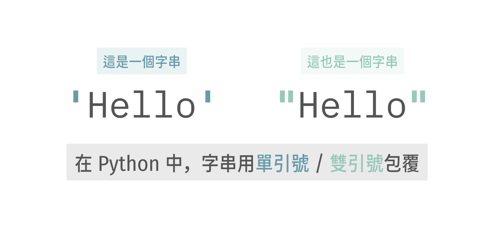
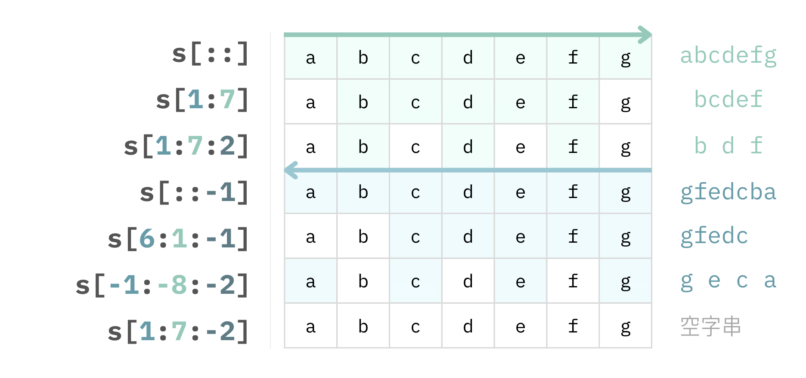
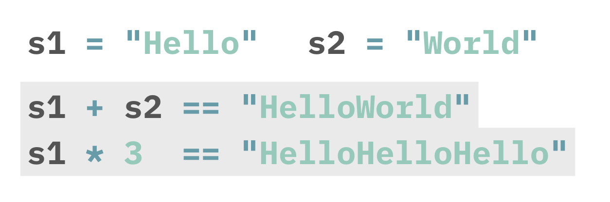
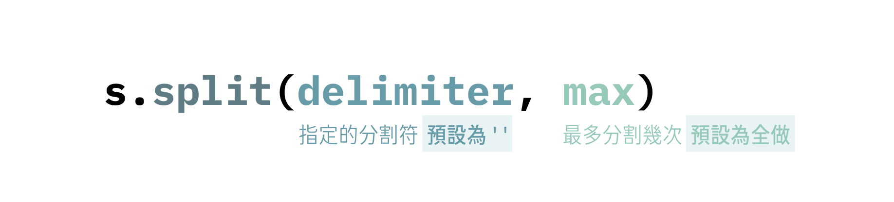
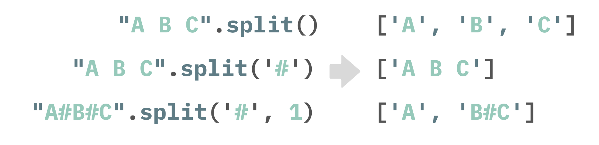
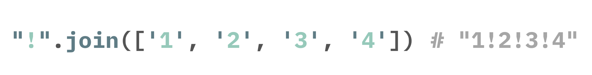
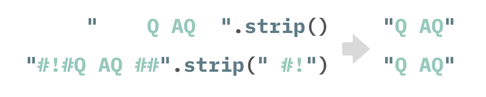
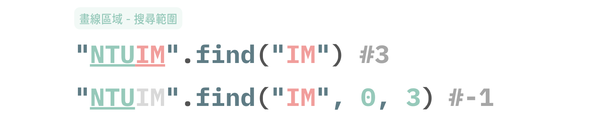
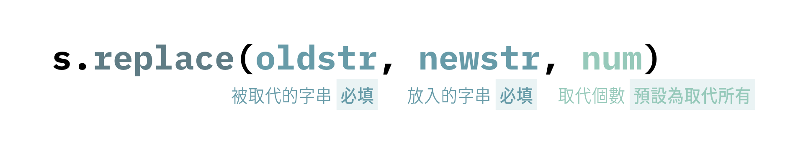

# Chapter 6： 字串 (string)

> **Benson Chiu** 邱秉辰 @ NTU IM CAMP 2024
> Department of Information Management, National Taiwan University.

## 字串的基本架構 *

在正式認識字串之前，我們先來看看**字元 (characters) **是什麼：簡單來說，[字元](https://idv.sinica.edu.tw/bear/charcodes/Section01.htm)是**人類語文的最基本單位**，舉凡英文字母、標點符號、中文漢字、阿拉伯數字、空格等等都是字元的其中一個種類。

> [小知識] 在電腦中，每一個字元都被賦予一個**標準編碼**。以**現代英語**為例，**ASCII** 碼可以表達基本拉丁字母、阿拉伯數字和英式標點符號，Big5 是常見的**正體中文** 編碼標準，而 **Unicode** 涵蓋了世界上大部分的文字系統。

若我們**將多個字元組合起來**，這些被組合在一起字元就變成了所謂的**字串 (string)**，像是一個英文單字 (E.g. "Hello") 抑或是一句話都可以 (E.g. "It's a good day!") 被視為一個字串。

字串是 Python 最常見的資料型態之一。在 Python 中，為表示某一串字元是字串，我們使用**單引號**或**雙引號**將其包覆。



### 字串的初始化

字串的初始化非常簡單，方式和 **Chapter 2** 的變數初始化相同

```python
#範例 6.1.1
s1 = "Hello"
s2 = 'This is a string'
```

接續 **範例 6.1.1** 我們可以用**中括號 []** 對字串進行取值

```python
#範例 6.1.2
print(s1[0]) #H
print(s2[-1]) #g
```

惟需要特別注意的是，**string** 是一個**不可變 (Immutable)** 的容器，因此，**我們不可以對字串的某一項進行改值**。

```py
#範例 6.1.3
s1[0] = 'B' #Error!
```

### 字串的走訪

**string** 可被視為容器的其中一種，因此，我們可以搭配 `for` 迴圈對**字串的每一項**進行走訪

```py
#範例 6.2.1
s = "Hello World"
for i in s:
    print(i)
```

和 list 相似，我們可以透過 `len()` 函數取得該字串的長度

```py
# 範例 6.2.2
print(len(s))
```

當然，透過與 `len()` 函數的搭配，我們也可以**對字串的索引** (indices) 進行走訪

```py
# 範例 6.2.3
for i in range(len(s)):
    print(i, s[i])
```

### 子字串的判斷

透過 `a in b` 與 `a not in b`，我們可以判斷字串 `a` 是否是**字串 `b` 的子字串**

``` py
# 範例 6.3
s = "Welcome to NTUIM"
print("NTUIM" in s) #True
print("NTUIM" not in s) #False
print("NTUCSIE" not in s) #True
```

## 字串的切片 (Slicing) *

我們可以透過  `s[::]` 的技巧對字串進行切片


於此，我們指定字串切割的**起始點 (上圖的 start)** 、**終點 (上圖的 end)** 與 **公差 (上圖的 step)**，並且在 $[start,end)$ 區間以 `step` 為公差對字串 `s` 進行取值。

> **Remarks**
>
> - $[start,end)$ 是**左閉右開區間**，意指範圍在 start 與 end 之間，**包含 start 但是不包含 end**
> - **`step` 預設為 1**，我們**可以將 `step` 省略不寫**而使用 `s[start: end]` 切割字串
> - 起點與終點的預設值：
>   - 若 `step > 0`：
>     -  `start` 預設為 0 / `end` 預設為 `len(s)`
>     - 必須滿足 `start < end` ，不然會**輸出空字串**
>   - 若 `step < 0`：
>     -  `start` 預設為 -1 / `end` 預設為 `-(len(s)+1)`
>     - 必須滿足 `start > end` ，不然會**輸出空字串**

假設 `s = 'abcdefg'`，以下舉一些字串切割的案例方便大家理解：



```py
# 範例 6.4
s = 'abcdefg'
print(s[:])
print(s[1:7])
print(s[1:7:2])
print(s[::-1])
print(s[6:1:-1])
print(s[-1:-8:-2])
print(s[1:7:-2])
```

## 字串的運算 *

### 串接 (Concatenate) - `+` 和 `*`

在 Python 字串的定義中：

- `+` 被用來 **串接(concatenate)** 其**左右兩個字串**
- 當然，字串本身也可以和自己串接，`*` 被用來 **串接多個相同的字串**



### 比較 - `==`, `!=`, `>` 和 `<`

透過 `==` 和 `!=`，我們可以判斷**兩字串相等與否**

```py
# 範例 6.6
s1 = "abc"
s2 = "def"
s3 = "abc"
print(s1 == s2)
print(s1 != s3)
```

透過 `>` 和 `<`，我們比較兩字串的[**字典序**](https://blog.csdn.net/HappyRocking/article/details/83619392)

- `s1 > s2 `：`s1` 的字典序**大於** `s2`
- `s1 < s2`：`s1` 的字典序**小於** `s2`

> **[Remark] 簡單說明字典序的比較方式**
>
> - 單個字元：`'0'<'1'<...<'a'<'b'<...<'z'`
> - 多個字元：假設比較兩個字串 `s1` 和 `s2`
>   - **從左往右**依次進行比較，直到某一位可以比出大小
>   - 若 `len(s1) < len(s2)` 且 兩字串的前 `len(s1)` 項都是相等，則 `s2` 的字典序較大
>
> 對字典序好奇的讀者可以繼續參考[這篇文章](https://blog.csdn.net/HappyRocking/article/details/83619392)

```py
# 範例 6.6.2
print(s1 < s2)
print(s2 > s3)
```

## 字串的常用方法 (Methods) *

### 大小寫轉換

- `s.upper()` : `s` 的內容全部轉成大寫
- `s.lower()` : `s` 的內容全部轉成小寫

```py
# 範例 6.7.1
s = "hEllOntUiM"
print(s.upper()) #HELLONTUIM
print(s.lower()) #hellontuim
```

> **[Remark]** 執行完 `s.upper()` 諸如此類的「方法」後，**不會對 `s` 本身有所改變**。換句話說，請把  `s.upper()`  （以及本節所述的常用方法們）回傳的內容視為一條**新的字串**！

### 判斷

- `s.isalpha()`：判斷字串每項元素是否都是英文字母
- `s.isnumeric()`：判斷字串每項元素是否都是數字
- `s.isalnum()`：判斷字串每項元素是否都是字母或數字
- `s.isupper()`：判斷字串每項元素是否都是大寫

```py
# 範例 6.7.2
s1 = "123456abc"
print(s1.isalpha()) #False
print(s1.isnumeric()) #False
print(s1.isalnum()) #True

s2 = "NTUIM"
print(s2.isupper()) #True
```

### `s.split()`

使用 `s.split()`，我們可以用給定的分割符作為中斷點將字串「大卸八塊」，並將每一塊存進一條新的 list 中



若我們沒有指定分割符，Python 預設以**空格**進行分割；另外，我們亦可以指定**最多分割的次數**，而 Python 預設會處理字串中**所有的分割符**。以下舉一些案例方便大家理解：



### `s.join()`

我們可以將 `s.join()` 視為 `s.split()` 的**反敘述**，以 `s` 作為分隔符將給定序列（型態可以是 list 或 tuple） 的**各項用分割符串接起來**


需要特別注意的是：`squence` 之內的各元素**皆需要是 string 型態**，我們才能使用  `s.join()` 的方法。以下舉一簡單案例方便大家理解：



### `s.strip()`

使用 `s.strip()`，我們可以從字串的**開頭**與**結尾**移除指定的符號


我們沒有指定任何符號，Python 預設會移除字串**頭尾**的**所有空格**。以下舉一些案例方便大家理解：



### `s.find()`

使用 `s.find()`，我們可以從字串 `s` 尋找指定的子字串並回傳位置（若找不到，則回傳 0）


需要特別注意的是，我們必須要在 `s.find()` 放入我們想要尋找的子字串；另外，我們亦可以使用額外的參數 (`start` 與 `end`) 去限制對字串搜尋的範圍，而 Python 預設會**搜尋整個字串**。以下舉一些案例方便大家理解：



### `s.replace()`

使用 `s.replace()`，我們可以將字串中的 `oldstr` 全部（或部分）替換成 `newstr`



在 `s.replace()` 中，我們必須傳入 **被取代的字串  `oldstr` **  與 **放入的字串  `newstr`**；另外，我們使用額外的參數 `num` 去限制取代的總次數，而 Python 預設會**用 `newstr` 取代所有  `oldstr`**。以下舉一些案例方便大家理解：


> 以上僅是 string method 的部分舉例，關於更多資訊，同學可以參考 [W3schools 的參考文件](https://www.w3schools.com/python/python_strings_methods.asp)

## 格式化字串 (Format Strings) **

在許多情況下，我們輸出內容的字串中總是**參雜著其他型態的變數**，例如：int, float 等。


我們將上述的例子一般化，假設現在 `apple, orange` 和 `lemon` 分別是型態為 `int` 的變數並代表各水果種類的數量，也就是說：


其中一個最簡單的輸出方法：

```py
# 範例 6.8.1
apple, orange, lemon = map(int, input().split()) #處理輸入
print("I have", apple, "apples,", orange, "oranges and", lemon, "lemons.")
```

範例 6.8.1 是會正常輸出的，然而，這樣的作法非常麻煩且不直觀。在 Python 中，其提供了另外一種字串與其他型態**混合輸出**的方法 —— 格式化字串。

我們可以在輸出的字串中透過`{}` **預先安放**插入其他變數的空間，隨後，再利用 `.format()` 將指定的變數依序放入。

```py
# 範例 6.8.2
apple, orange, lemon = map(int, input().split()) #處理輸入
print("I have {} apples, {} oranges and {} lemons.".format(apple, orange, lemon))
```

僅管範例 6.8.2 最後的輸出結果還是和範例 6.8.1 完全相同，但是透過格式化字串的方式，字串和其他不同型態變數的**混合輸出**變得清楚俐落許多。讀者也可以想像當變數的數量變得更大時，格式化字串想必更具優勢。

> 篇幅因素，字串格式化的部分筆者僅是簡單帶過，關於更多資訊，同學可以參考 [W3schools 的參考文件](https://www.w3schools.com/python/ref_string_format.asp)

## References

- [Python 3.11 Documentation]( https://docs.python.org/3/contents.html)
- [W3School - Python Tutorial](https://www.w3schools.com/python/default.asp)
- [資訊之芽 Python 班歷年講義](https://tw-csie-sprout.github.io/py2023/) 

If you have any questions, feel free to ask me via my email :) 

- [bensonchiu1129@gmail.com](mailto:bensonchiu1129@gmail.com)
- [bensonchiu1129@ntu.im](https://imbensonchiu.github.io/bensonchiu1129@ntu.im)

*Copyright © 2023 Benson Chiu. All rights reserved.*